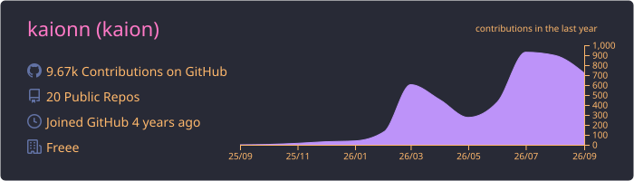
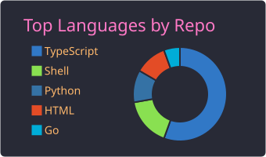
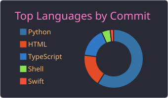
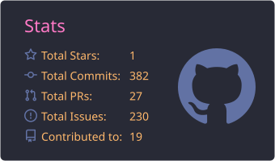
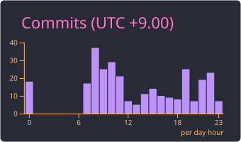

<!-- Animated Header -->

<!-- Profile Views & Social Badges -->

  
  
  

---

## 👤 About Me

- 🛠️ **Ruby on Rails** を軸に、**TypeScript / Next.js** でフロントエンドも書くWebエンジニア
- 🤖 最近は **Claude Code** を使った開発ワークフローの自動化・エージェント活用に注力
- 🧪 個人開発では小さなプロダクトを高速に作って検証するスタイル
- ✍️ 学んだことは [Qiita](https://qiita.com/kaion) にアウトプット
- 💬 気軽に [Twitter](https://twitter.com/kai0nnn) でどうぞ

---

## 🚀 Tech Stack

### Languages & Frameworks

### Tools & Environment

---

## 📊 GitHub Stats

---

## 🏆 GitHub Trophies

---

## ⚡ Recent Activity

<!--START_SECTION:activity-->
1. 🗣 Commented on [#209](https://github.com/kaionn/pain-collector/issues/209#issuecomment-4879384961) in [kaionn/pain-collector](https://github.com/kaionn/pain-collector)
2. 🗣 Commented on [#211](https://github.com/kaionn/pain-collector/issues/211#issuecomment-4879384903) in [kaionn/pain-collector](https://github.com/kaionn/pain-collector)
3. 🗣 Commented on [#211](https://github.com/kaionn/pain-collector/issues/211#issuecomment-4879384846) in [kaionn/pain-collector](https://github.com/kaionn/pain-collector)
4. 🗣 Commented on [#186](https://github.com/kaionn/pain-collector/issues/186#issuecomment-4877583781) in [kaionn/pain-collector](https://github.com/kaionn/pain-collector)
5. 🗣 Commented on [#184](https://github.com/kaionn/pain-collector/issues/184#issuecomment-4877583680) in [kaionn/pain-collector](https://github.com/kaionn/pain-collector)
6. 🗣 Commented on [#223](https://github.com/kaionn/pain-collector/issues/223#issuecomment-4877583538) in [kaionn/pain-collector](https://github.com/kaionn/pain-collector)
7. ℹ️ Labeled issue [#223](https://github.com/kaionn/pain-collector/issues/223) in [kaionn/pain-collector](https://github.com/kaionn/pain-collector)
8. ℹ️ Labeled issue [#223](https://github.com/kaionn/pain-collector/issues/223) in [kaionn/pain-collector](https://github.com/kaionn/pain-collector)
<!--END_SECTION:activity-->

---

## 📈 Activity Graph

---

## 💻 Development Environment

| Category | Choice |
|:--------:|:------:|
| 🖥️ **OS** | macOS |
| ⌨️ **Editor** | VS Code |
| 🐚 **Shell** | zsh |
| 📟 **Terminal** | iTerm2 |
| ⌨️ **Keyboard** | HHKB Hybrid |
| 🖱️ **Pointing** | Magic Trackpad |
| ❤️ **Language** | Ruby |

---

### 🐍 Contribution Snake

---

  

